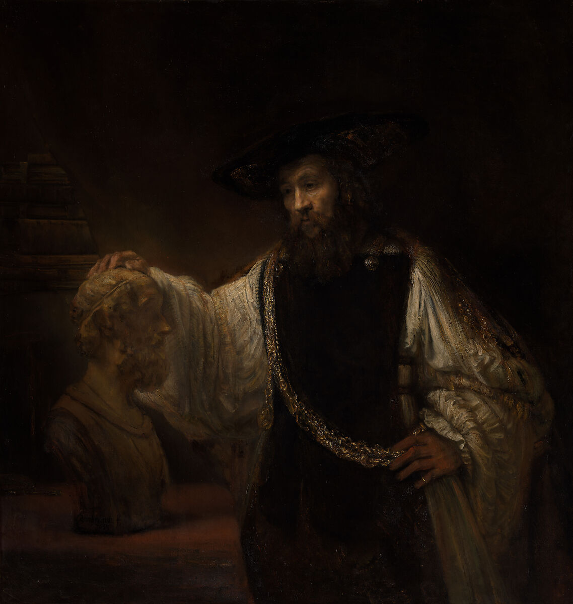

# Kindred Spirit: Building an LLM that follows personal ethics

<table>
<tr>
<td width="50%">

<br><sub><sup>Aristotle with a Bust of Homer - Rembrandt (1653)</sup></sub>
</td>
<td width="50%" valign="middle">
<h3>Aristotle</h3>
<blockquote>
<p><em>"We are what we repeatedly do. Excellence, then, is not an act, but a habit."</em></p>
</blockquote>
</td>
</tr>
</table>

---

> **"Rather than asking 'What are your values?' directly, the calibration uses concrete dilemmas to reveal actual decision-making patterns. This avoids the gap between stated principles and real-world choices."**

---

## Project Overview

This project explores whether a 7B parameter language model can be fine-tuned to embody an individual's personal value system, going beyond generic AI safety training to reflect nuanced, sometimes contradictory, human ethics.

### Key Components

- **Calibration Tool**: Interactive CLI that presents 74 questions across political, ethical, and philosophical domains
- **Training Data**: 132 instruction-response pairs generated from calibration responses
- **Fine-Tuned Model**: Qwen2.5-7B-Instruct with LoRA adapter (155MB)
- **Validation**: Test responses against value scenarios to measure alignment

### Approach

1. **Value Discovery** - Map personal values through concrete dilemmas
2. **Dataset Generation** - Convert calibration responses into training pairs
3. **LoRA Fine-Tuning** - Train lightweight adapter on base model
4. **Validation** - Test model responses for value alignment

## Files

- `calibrate_kindred_spirit.py` - Interactive calibration tool
- `generate_training_data.py` - Convert calibration to training dataset
- `train_nigel_values.py` - LoRA fine-tuning script
- `test_nigel_adapter.py` - Model testing and validation
- `LLM_PersonalEthics.md` - Complete project documentation
- `nigel_lora_adapter/` - Fine-tuned LoRA adapter weights

## Hardware Requirements

- **GPU**: NVIDIA RTX 6000 Ada Generation (48GB VRAM) or similar
- **VRAM**: Minimum 24GB for inference, 48GB recommended for training
- **Storage**: ~2GB for adapter, ~15GB for base model

## Quick Start

```bash
# Install dependencies
pip install transformers peft torch datasets accelerate bitsandbytes

# Run calibration
python calibrate_kindred_spirit.py

# Generate training data
python generate_training_data.py

# Train model
python train_nigel_values.py

# Test adapter
python test_nigel_adapter.py
```

## Documentation

See [LLM_PersonalEthics.md](LLM_PersonalEthics.md) for complete project documentation including:
- Detailed calibration methodology
- Training data generation process
- Model training configuration
- Performance metrics and results
- Evaluation and conclusions

## License

Apache 2.0

## Author

Nigel Burton  
January 31, 2026
