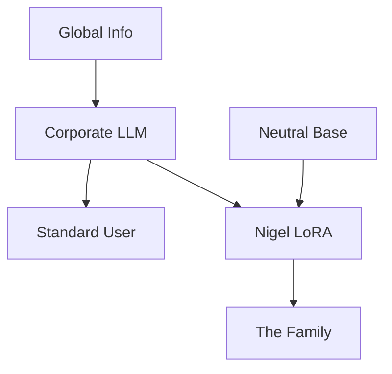

# Kindred Spirit: The Sovereign Ethics Layer

<table>
<tr>
<td width="50%">

<br><sub><sup>Aristotle with a Bust of Homer - Rembrandt (1653)</sup></sub>
</td>
<td width="50%" valign="middle">
<h3><a href="https://en.wikipedia.org/wiki/Aristotle">Aristotle</a> (384-322 BCE)</h3>
<blockquote>
<p><em>"We are what we repeatedly do. Excellence, then, is not an act, but a habit."</em></p>
</blockquote>
<br>
<h3><a href="https://en.wikipedia.org/wiki/George_Orwell">George Orwell</a> (1903-1950)</h3>
<blockquote>
<p><em>"Who controls the past controls the future. Who controls the present controls the past."</em></p>
</blockquote>
<br>
<h3><a href="https://en.wikipedia.org/wiki/Hannah_Arendt">Hannah Arendt</a> (1906-1975)</h3>
<blockquote>
<p><em>"The sad truth is that most evil is done by people who never make up their minds to be good or evil."</em></p>
</blockquote>
</td>
</tr>
</table>

---
> "I am building this so my daughters have an AI that reflects the nuance of history and the weight of personal conscience, rather than the sterilized safety-tuning of a corporation."

## 🚀 The Mission
**Kindred Spirit** is an experimental framework for personalizing the moral and ethical foundations of Large Language Models. 

Standard LLMs are "Thin Clients" for centralized, corporate ethics. Kindred Spirit moves the "Moral Processing" back to the individual. By fine-tuning a model on a curated set of 70+ personal ethical dilemmas, we create a **Sovereign Intelligence**—an AI that acts as a true "Kindred Spirit" to its creator.

## 🏗 System Architecture

Kindred Spirit uses a **LoRA (Low-Rank Adaptation)** approach to "overlay" a personal ethical framework onto a neutral base model.



### Technical Specifications

- **Base Model:** Qwen2.5-7B (Abliterated)
- **Adapter:** LoRA (Rank 64 / Alpha 128)
- **Hardware:** NVIDIA RTX 6000 Ada (48GB VRAM)
- **Framework:** Unsloth / HuggingFace PEFT
- **Training Data:** 74 high-stakes moral dilemmas + 400 general examples

---

## 📚 Core Philosophies

The model is grounded in three primary invariants:

- **Hannah Arendt:** Recognizing and resisting the "Banality of Evil"
- **George Orwell:** Protecting the "Ground Truth" from linguistic and historical drift
- **The Fat Client:** Maintaining technical and moral sovereignty at the local node

---

## 🔧 Obtaining the Abliterated Base Model

To remove corporate refusal behaviors and safety overrides, this project uses an **abliterated** (orthogonalized) version of Qwen2.5-7B. The weights have been processed to eliminate hard-coded refusal patterns while maintaining the model's core capabilities.

### Recommended Base Model

**[failspy/Qwen2.5-7B-Instruct-Abliterated-v3](https://huggingface.co/failspy/Qwen2.5-7B-Instruct-Abliterated-v3)**

This model has:
- Refusal behaviors removed through orthogonalization
- Full `.safetensors` weights available for download
- Maintained reasoning and instruction-following capabilities

### Setup Instructions

1. Visit the [Hugging Face repository](https://huggingface.co/failspy/Qwen2.5-7B-Instruct-Abliterated-v3)
2. Verify `.safetensors` files are present in the "Files and versions" tab
3. Update your training script to point to this `model_id`:

```python
model_id = "failspy/Qwen2.5-7B-Instruct-Abliterated-v3"
```

The model will be automatically downloaded when you run the training script, or you can pre-download it using:

```bash
huggingface-cli download failspy/Qwen2.5-7B-Instruct-Abliterated-v3
```

---

## 📂 Project Structure

- `calibrate_kindred_spirit.py` - Interactive calibration tool presenting 74 ethical dilemmas
- `generate_training_data.py` - Convert calibration responses into training dataset
- `train_nigel_values.py` - LoRA fine-tuning script
- `test_nigel_adapter.py` - Model testing and validation
- `nigel_lora_adapter/` - Fine-tuned LoRA adapter weights
- `training_data/` - Generated training datasets
- `LLM_PersonalEthics.md` - Complete philosophical and technical documentation

---

## 🎯 Quick Start

```bash
# Install dependencies
pip install transformers peft torch datasets accelerate bitsandbytes

# Run calibration to discover your values
python calibrate_kindred_spirit.py

# Generate training data from calibration
python generate_training_data.py

# Train your personalized adapter
python train_nigel_values.py

# Test the fine-tuned model
python test_nigel_adapter.py
```

---

## 📖 Documentation

See [LLM_PersonalEthics.md](LLM_PersonalEthics.md) for complete project documentation including:
- Detailed calibration methodology
- Training data generation process
- Model training configuration and hyperparameters
- Performance metrics and evaluation results
- Philosophical foundations and conclusions

---

## 📜 License

Apache 2.0

---

**Created by Nigel Burton, 2026**  
*A tool for the next generation.*